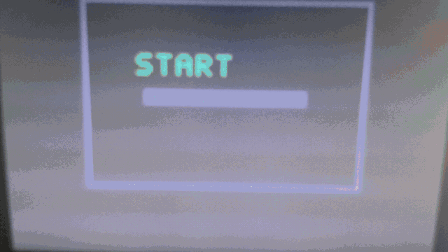

# RV32I Starflight FPGA

A custom RV32I-style RISC-V CPU on an Intel MAX 10 DE10-Lite FPGA, extended with a procedural pseudo-3D VGA space shooter controlled by the onboard accelerometer and pushbutton input.

The active Quartus top-level entity is `riscv_soc`.

## Demo



## Project Scope

- Custom 32-bit RV32I-style CPU core in Verilog
- Memory-mapped accelerometer, buttons, LEDs, HEX displays, and VGA game registers
- 640x480 procedural VGA renderer with a ship and depth-scaled asteroid
- ADXL345 X/Y tilt input with smooth two-axis ship movement
- Bare-metal C firmware target for `rv32i` / `ilp32`
- Questa CPU and VGA simulation testbenches

## Hardware

Target board: Terasic DE10-Lite, MAX 10 `10M50DAF484C7G`.

The current game architecture avoids a framebuffer. The ADXL345 SPI controller reads both X and Y axes, while FPGA logic converts tilt into smooth ship targets, generates VGA timing, and draws the scene.

## Firmware

The firmware is compiled for the CPU's supported base ISA:

```text
-march=rv32i -mabi=ilp32
```

Build with the xPack bare-metal toolchain or another compatible toolchain. The xPack installation uses the `riscv-none-elf-*` executable prefix:

```powershell
$env:RISCV = 'C:\Users\ayush\AppData\Roaming\xPacks\@xpack-dev-tools\riscv-none-elf-gcc\15.2.0-1.1\.content'
.\software\build.ps1
```

The script generates `software/firmware.elf` and `software/imem.hex`. The instruction image is versioned because the FPGA ROM consumes it directly.

The instruction ROM is 16 KiB (4,096 words) and data RAM is 8 KiB (2,048
words). This leaves sufficient instruction-ROM capacity for generated
read-only Transformer model arrays while preserving data RAM for the runtime
context, intermediate activations, and stack.

Generate the no-LayerNorm model headers from the sibling NPU repository before
building Transformer firmware:

```powershell
Set-Location ..\rv32i-fpga-npu
python scripts\train_and_export.py --output-dir model_hex
python scripts\export_c_header.py --model-dir model_hex --output ..\riscPROJET\software\model_weights.h
Copy-Item model_hex\quantization_config.h ..\riscPROJET\software\
Set-Location ..\riscPROJET
```

## Build and Test

### CPU and VGA simulation

From the project root, with Questa on the standard Intel installation path:

```powershell
& 'C:\altera_lite\25.1std\questa_fse\win64\vlog.exe' -work work rtl/alu.v rtl/pc.v rtl/reg_file.v rtl/decoder.v rtl/lsu.v rtl/riscVCPU.v tb/tb_cpu.v
& 'C:\altera_lite\25.1std\questa_fse\win64\vsim.exe' -c tb_cpu -do 'run -all; quit -f'
& 'C:\altera_lite\25.1std\questa_fse\win64\vlog.exe' -work work rtl/vga_timing.v rtl/game_video.v tb/tb_video.v
& 'C:\altera_lite\25.1std\questa_fse\win64\vsim.exe' -c tb_video -do 'run -all; quit -f'
```

Both tests should print `PASS`.

### Build the C game firmware

The current CPU requires a bare-metal RV32I toolchain. The installed xPack package is `@xpack-dev-tools/riscv-none-elf-gcc@15.2.0-1.1`; use its `.content` directory as `RISCV`:

```powershell
$env:RISCV = "$env:APPDATA\xPacks\@xpack-dev-tools\riscv-none-elf-gcc\15.2.0-1.1\.content"
.\software\build.ps1
```

This updates `software/imem.hex`. The current game image contains 86 RV32I instructions; a nine-word image is the old accelerometer display demo.

### Run the NPU smoke test

The NPU occupies `0x0006_xxxx` and is connected to the RV32I data bus. Build
the standalone smoke test with:

```powershell
.\software\build.ps1 -Source npu_demo.c
```

It writes a signed 16x16 identity matrix, sixteen INT8 activations, and sixteen
biases to the NPU. The NPU autonomously executes all sixteen 4x4 MAC tiles,
verifies packed Q4.4 outputs of one and equal Q0.16 softmax probabilities of
4095, then lights all ten LEDs on success. Rebuild the default game with
`.\software\build.ps1` before using the VGA demo again.

### Build Transformer firmware

Generate `software\model_weights.h` and `software\quantization_config.h` from
the sibling NPU repository, then build:

```powershell
.\software\build.ps1 -Source npu_transformer.c
```

`npu_transformer.c` loads prompt `THOU `, streams each model tile through NPU
MMIO, executes Q/K/V/O, causal attention, FFN, and four vocabulary tiles, then
writes predicted 64-token ASCII index to LEDs at `0x0004_0000`.

### Build in Quartus

Open `riscVCPU.qpf` in Quartus Prime, or run:

```powershell
.\scripts\build_fpga.ps1
```

The script runs the complete Quartus flow and should create `output_files\riscVCPU.sof`.

Program that `.sof` with Quartus Programmer using the DE10-Lite USB-Blaster. Connect VGA before powering the board. Release reset, then verify the static scene before testing accelerometer movement and the button input.

### Current test status

The CPU and VGA simulations pass. The C game firmware builds successfully with the xPack toolchain and fits within the 256-word instruction ROM. The latest successful Quartus build includes the VGA renderer and game firmware, with 1,885 logic elements, 191 registers, and positive setup and hold slack at the 50 MHz CPU clock.

## Verification

The CPU regression and VGA renderer tests are run with Questa. Quartus analysis and fitting are used for the DE10-Lite top-level integration.

## Status

The CPU, VGA renderer, two-axis accelerometer control, and C game firmware are implemented and simulation/build tested. The latest Quartus flow produces `output_files\riscVCPU.sof` and reports a worst-case Fmax of 80.19 MHz, +7.530 ns setup slack, and +0.340 ns hold slack. Final hardware validation still requires programming the `.sof` and testing VGA, accelerometer input, and buttons on the physical DE10-Lite.